# Next Level

- 외국인 대상 한국어 학습 플랫폼

# 목차

1. [결과물](#결과물)
2. [서비스 화면](#서비스-화면)
3. [주요 기능](#주요-기능)
4. [개발 환경](#개발-환경)
5. [기술 소개](#기술-소개)
6. [설계 문서](#설계-문서)
7. [팀원 소개 및 역할](#팀원-소개-및-역할)

# 결과물

- 📽 [UCC](https://pusanackr-my.sharepoint.com/:v:/g/personal/dms5474_pusan_ac_kr/EdFLFrlLxMBOqwpnmU5AFpcB8i__HCUemyAoSYLEVCD7hQ?nav=eyJyZWZlcnJhbEluZm8iOnsicmVmZXJyYWxBcHAiOiJPbmVEcml2ZUZvckJ1c2luZXNzIiwicmVmZXJyYWxBcHBQbGF0Zm9ybSI6IldlYiIsInJlZmVycmFsTW9kZSI6InZpZXciLCJyZWZlcnJhbFZpZXciOiJNeUZpbGVzTGlua0RpcmVjdCJ9fQ&e=yN4DKr)
- 🎤 [중간 발표 자료](https://pusanackr-my.sharepoint.com/:b:/g/personal/dms5474_pusan_ac_kr/EdqbdTJvO5xMirmsH-FE7LIB1RELD5no_qVgf_tEfyeUvA?e=IfhNO9)
- 🎤 [최종 발표 자료](https://pusanackr-my.sharepoint.com/:b:/g/personal/dms5474_pusan_ac_kr/EQIazOFSy0lGjBriKRBGi4MBoTRXrIuiAs-JDx4IPZ3nWg?e=2JFsFf) 

# 서비스 화면

|  | 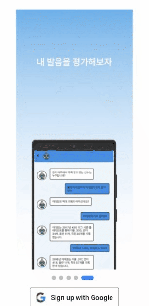 |
| ---------------------------------------------------------------------------------- | ----------------------------------------------------------------------------------- |
| 랜딩페이지 및 온보딩 페이지                                                                    | 구글 로그인 및 추가정보 입력                                                                    |
| 어플이 로딩되는 동안 랜딩 페이지가 보여집니다.                                                         | 구글 로그인 성공 시, 회원이 아니라면 회원가입을 진행합니다. 기본적인 요소를 받아오고, 닉네임 및 프로필 사진을 추가 정보로 입력받습니다.      |

## 🎤 콘텐츠 페이지(노래)

|        | 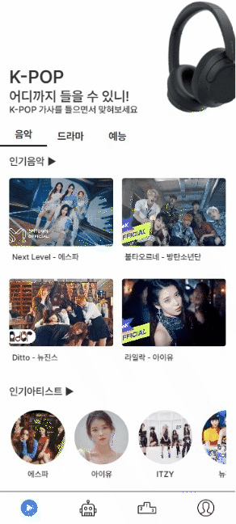 |  |
| ---------------------------------------------------------------------------------------- | ------------------------------------------------------------------------------------ | ------------------------------------------------------------------------------ |
| 노래 페이지                                                                                   | 인기 음악 리스트(검색) 페이지                                                                    | 인기 아티스트 페이지                                                                    |
| 콘텐츠 페이지의 기본 페이지로, 스와이프를 통해서 드라마, 예능으로 옮길 수 있습니다. 인기 음악과 인기 아티스트를 제공하며 클릭 시 해당 화면을 이동합니다. | 사람들이 많이 푼 문제 순으로 노래를 제공하며, 원하는 가수나 제목을 검색해 해당하는 노래를 보여줍니다.                           | 등록되어 있는 아티스트들을 보여주고, 해당 아티스트 클릭 시 해당  아티스트의 노래 리스트를 보여줍니다.                     |

|  |  |  |
| ---------------------------------------------------------------------------------- | --------------------------------------------------------------------------------------------------- | ------------------------------------------------------------------------------------- |
| 노래 받아쓰기 페이지(노래)                                                                    | 노래 받아쓰기 페이지(정답 입력 및 힌트)                                                                             | 노래 받아쓰기 페이지(정답 제출)                                                                    |
| 노래 게임을 진행하는 페이지로, 접속 시 해당하는 노래의 문제 앞부분부터 자동으로 플레이 되며 카운트다운 이후 문제가 나오게 됩니다.         | 아래의 입력 창에 답을 적을 수 있으며, 위의 칸을 클릭하여 한 글자씩 수정 가능합니다. 라운드당 1개씩 힌트를 사용할 수 있고, 힌트 사용 시 획득 가능한 포인트가 줄어듭니다. | 정답 제출 시 틀리면 다음 라운드로 바로 진행이 됩니다. 정답을 맞힐 경우 정답이라는 창이 뜨며 이전 페이지로 나가게 됩니다.                |

## 📽 콘텐츠 페이지(드라마, 예능)

|  |  |  |
| ---------------------------------------------------------------------------------- | ---------------------------------------------------------------------------- | ------------------------------------------------------------------------------------------------------------------------------ |
| 드라마 페이지                                                                            | 전체 드라마 목록                                                                    | 드라마 쉐도잉 페이지                                                                                                                    |
| 콘텐츠 페이지의 2번째 페이지입니다. 오늘의 드라마에서 2개의 클립을 추천하고, 아티스트를 선택하여 해당 아티스트가 출연한 클립을 볼 수 있습니다. | 등록되어 있는 드라마들을 보여주고, 해당 드라마 클릭 시 해당 드라마의 클립 리스트를 보여줍니다.                       | 클립의 영상 및 전체 대사 리스트를 제공하며, 대사 클릭 시 해당 위치로 이동합니다. 재생 버튼을 통해 클립을 재생하고, 마이크 버튼을 통해 녹음을 진행할 수 있습니다. 스피커 버튼을 통해 녹음한 목소리를 들어볼 수 있습니다. |

| 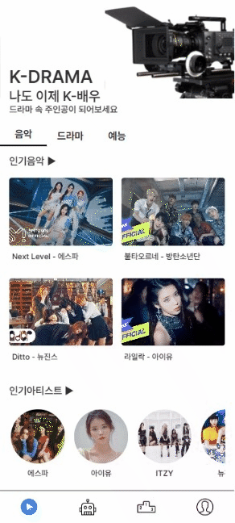                                            |  |                                                                                       |
| -------------------------------------------------------------------------------------------------------------------- | --------------------------------------------------------------------------- | ------------------------------------------------------------------------------------------------------------------------------------------------------------------ |
| 예능 페이지                                                                                                               | 전체 예능 목록                                                                    | 예능 쉐도잉 페이지                                                                                                                                                         |
| 콘텐츠 페이지의 3번째 페이지입니다. 오늘의 예능에서 클립 2개를 추천하고, 아티스트를 선택하여 해당 아티스트가 출연한 클립을 볼 수 있습니다. | 등록되어 있는 예능들을 보여주고, 해당 예능 클릭 시 해당 예능의 클립 리스트를 보여줍니다.                         | 클립의 영상 및 전체 대사 리스트를 제공하며, 대사 클릭 시 해당 위치로 이동합니다. 재생 버튼을 통해 클립을 재생하고, 마이크 버튼을 통해 녹음을 진행할 수 있습니다. 스피커 버튼을 통해 녹음한 목소리를 들어볼 수 있습니다. |

## 💭 학습 페이지

|                                                                   | 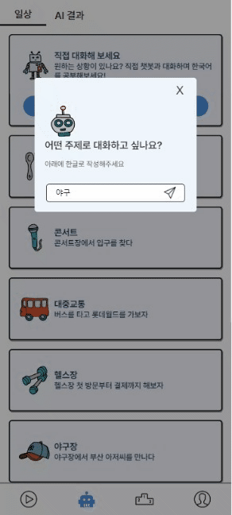            |
| --------------------------------------------------------------------------------------------------------------------------------------------- | ------------------------------------------------------------------------------------ |
| 학습 목록 페이지                                                                                                                                     | 챗봇 페이지                                                                               |
| 일상대화 학습 목록 페이지로, 스와이프를 통해 발음 평가 결과를 확인하는 페이지로 넘어갈 수 있습니다. 대화 시작하기 버튼 클릭 시 자기가 원하는 상황에 대해 챗봇과 대화를 이어갈 수 있습니다. 등록되어 있는 상황을 클릭하여 학습을 진행할 수 있습니다. | 학습 목록 페이지에서 원하는 주제를 입력하여 생성된 챗봇이 있는 페이지로 들어올 수 있습니다. 입력한 주제에 대해 챗봇과 대화하며 학습할 수 있습니다. |

|  | 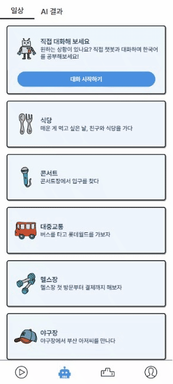 |
| ---------------------------------------------------------------------------- | --------------------------------------------------------------------------- |
| 일상 학습 페이지                                                                    | AI결과 페이지                                                                    |
| 실생활에 밀접한 대화를 직접 발화하여 녹음할 수 있으며, 발음 평가를 통해 점수로 확인할 수 있습니다.                    | 본인이 진행했던 발음 평가의 결과를 확인할 수 있습니다. 결과에는 자신 진행했던 대화 주제와 진행했던 날짜 및 점수가 나타납니다.    |

## 🏃‍♂️ 랭킹 페이지

| 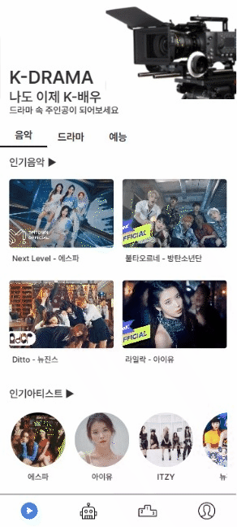 |
| ------------------------------------------------------------------------- |
| 랭킹 페이지                                                                    |
| 현재 자신의 점수가 최상단에 나오게 되며 상위 10명의 유저 정보가 제공됩니다.                              |

## 👨🏼‍🤝‍👨🏼 마이 페이지

|                                                                   | 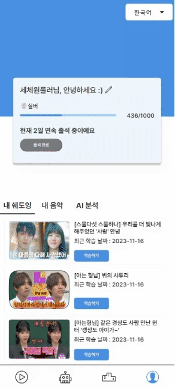         |
| ------------------------------------------------------------------------------------------------------------------------------------------ | --------------------------------------------------------------------------------- |
| 마이 페이지                                                                                                                                     | 수정 페이지                                                                            |
| 마이페이지에서 현재 자신의 점수와 티어를 볼 수 있습니다. 출석을 통해 출석 점수를 얻을 수 있고, 자신이 진행했던 쉐도잉과 노래 받아쓰기, 발음 평가 결과를 볼 수 있습니다. 우측 상단의 언어 선택을 통해 해당 언어로 서비스를 이용할 수 있습니다 | 프로필 사진 및 닉네임을 수정할 수 있으며, 중복 확인을 통해 중복된 닉네임을 사용할 수 없습니다. 로그아웃 시 다시 로그인 페이지로 돌아갑니다. |

# 주요 기능

### - 노래 받아쓰기

### - 드라마 및 예능 클립 쉐도잉

### - 일상 대화 학습 및 AI발음 평가

### - 원하는 주제에 대한 챗봇과의 대화

# 개발 환경

## ⚙ Management Tool

- **형상 관리 : Gitlab**
- **이슈 관리 : Jira**
- **커뮤니케이션 : Mattermost, Notion, Discord**
- **디자인 : Figma**

## 💻 IDE

- Visual Studio Code `1.18.1`
- IntelliJ `2023.1.3`

## 💻 OS

- Ubuntu `20.04 LTS`

## 📱 Frontend

- React `18.2.0`
- Vite `^4.4.5`
- Library
  - antd-mobile : `^5.33.0`
  - apex
  - axios : `^1.5.1`
  - apexcharts: `^3.44.0`
  - audiobuffer-to-wav: `^1.0.0`
  - axios: `^1.5.1`
  - eslint-config-airbnb-typescript: `^17.1.0`
  - framer-motion: `^10.16.4`
  - i18next: `^23.6.0`
  - react-apexcharts: `^1.4.1`
  - react-canvas-confetti: `^1.4.0`
  - react-highlight-words: `^0.20.0`
  - react-i18next: `^13.3.1`
  - react-modal: `^3.16.1`
  - react-router-dom `6.17.0`
  - react-responsive-carousel: `^3.2.23`
  - react-speech-recognition: `^3.10.0`
  - react-youtube: `^10.1.0`
  - regenerator-runtime: `^0.14.0`
  - styled-components: `^6.1.0`
  - swiper: `^11.0.3`
  - zustand: `^4.4.3`

## 💾 Backend

- Spring Boot : `2.7.15`
- JAVA : `11`
- MySQL : `8.0.35`
- Redis : `7.2.2`

## 🌈 Server & Infra

- AWS EC2
- AWS S3
- Docker : `24.0.6`
- Jenkins : `2.414.3`
- Nginx : `1.25.2`

# 기술 소개

- 웹 기반 하이브리드 어플리케이션
  
  - `PWA`를 활용하여 웹 및 앱 플랫폼 모두 사용 가능

- 구글 로그인
  
  - `OAUTH2` 인증을 이용해 불필요한 개인정보 입력 최소화

- Spring Cloud 및 컨테이너 기반의 MSA 환경
  
  - Java 기반의 Spring boot 애플리케이션을 개발하는데 편리하고, 서비스 디스커버리, 게이트웨이 등 많은 라이브러리 존재
  - Netflix Eureka
    - 마이크로 서비스들의 정보 등록
  - Gateway
    - 라우팅 설정에 맞게 클라이언트 요청을 보내고 응답
  - openfeign
    - 타 마이크로서비스의 API 호출을 위해 사용
    - 인터페이스, 어노테이션 기반으로 작성이 간편

- Redis
  
  - refresh token의 수명을 지정해 두면 만료 시 데이터를 삭제해준다는 점과 RDB에 저장하는 것보다 조회 속도가 빠르기 때문에 선택

- Clova API를 선택한 이유
  
  - 비교군
    - 리턴 제로(Whisper, Sommer 모델)
    - 구글 Cloud Speech-to-text v2 API
    - ETRI 공공 인공지능오픈 API - 음성인식
    - OpenAI Whisper
    - OpenAI Whisper Fine Tuning
      - AI HUB의 ****인공지능 학습을 위한 외국인 한국어 발화 음성 데이터****의 샘플 데이터 사용
    - CLOVA Speech
  
  발화자의 국적이나 모국어에 따라 같은 문장을 말하더라도 다르게 발음하는 부분이 있을 것이라 생각해 이를 고려하여 STT를 적용해야 한다고 생각함.
  
  초기 생각대로 파인 튜닝을 하려 해도 기존 모델에 국적 라벨이 없어 각 국가별 데이터로 모델을 각각 만들어야 했고, GPU 자원이 한정적이라 시간이 오래 걸려 힘들겠다는 결론을 내림. 그 결과 API 형식의 STT 중 가장 인식을 잘 했던 CLOVA Speech를 사용하기로 결정.

- GPT
  
  - 문제 : gpt api 특성상 이전 대화 내용을 기억하지 못해서 원활한 대화가 이어지지 않음
  - 해결 : gpt에게 주제 키워드를 알려주고 이전 대화 내용을 함께 전송해서 최대한 관계있는 답변을 유도함
  - 사용 기술 : 프롬프트 작성. gpt에게 상황 주제, 이전 대화 내용을 전달함.

# 설계 문서

## 🎨 와이어프레임

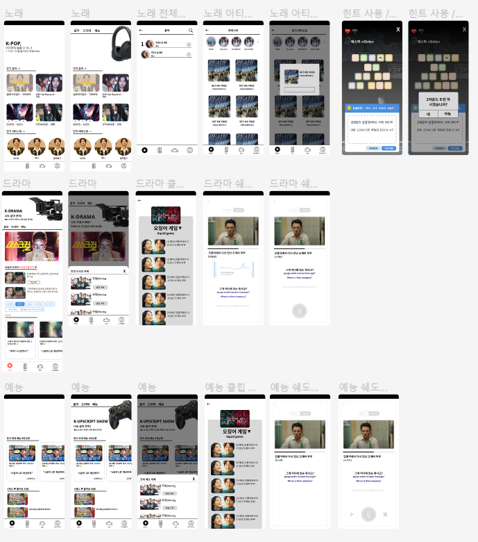

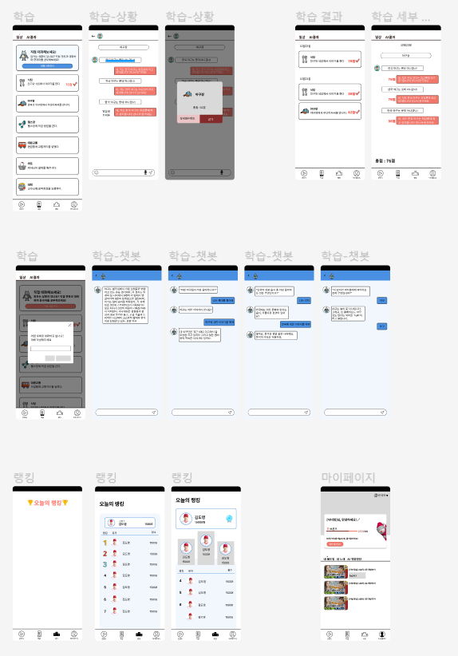

## 📃 기능 명세서

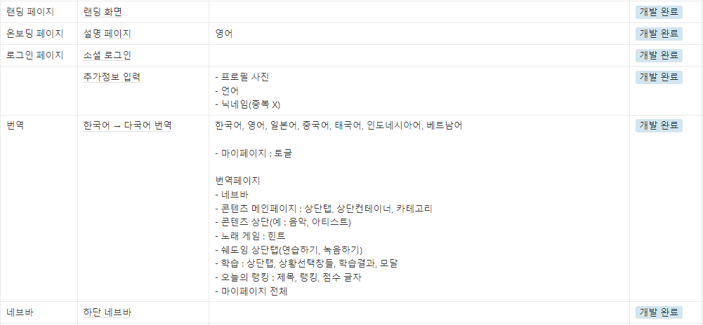
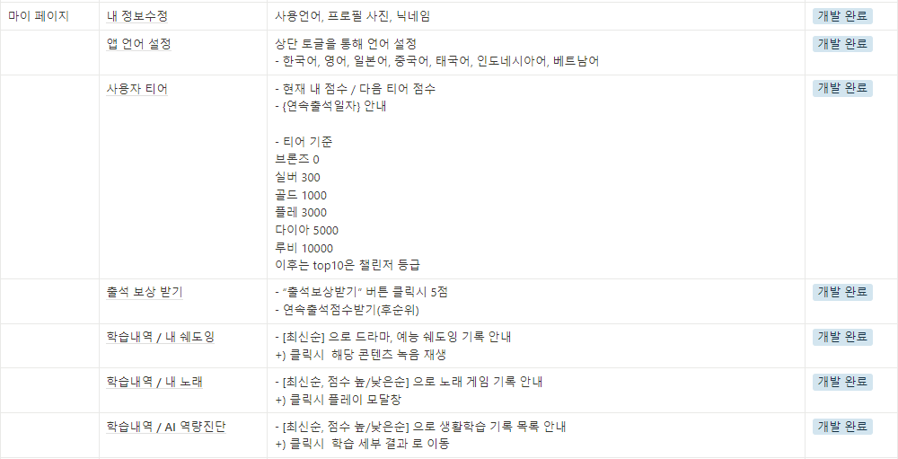
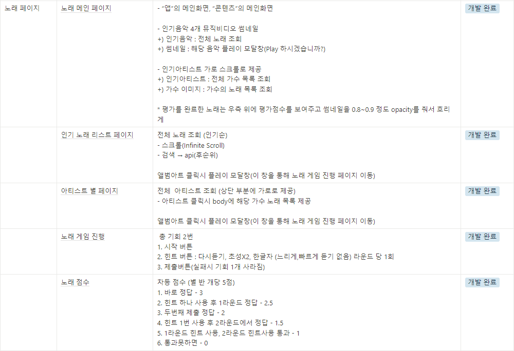
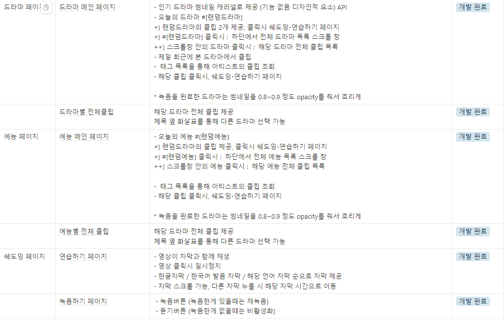
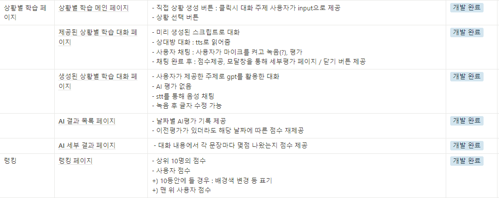

## 📝 API 명세서

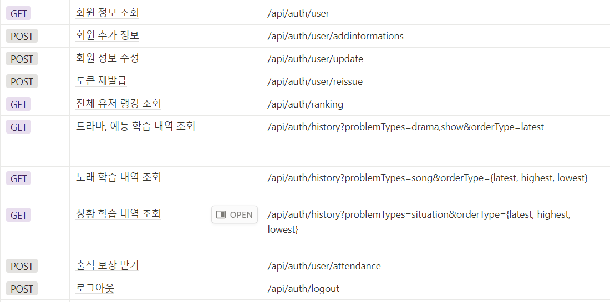

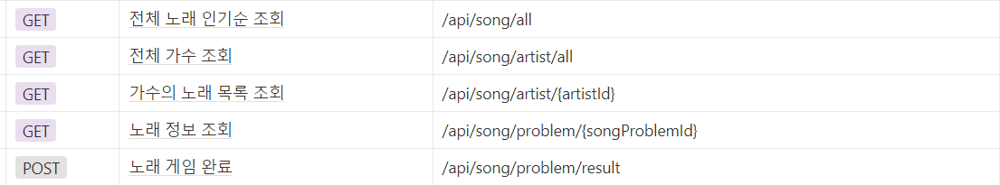

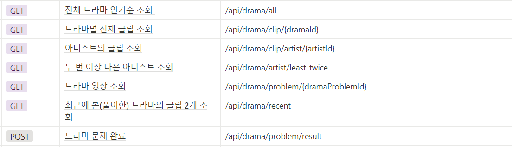

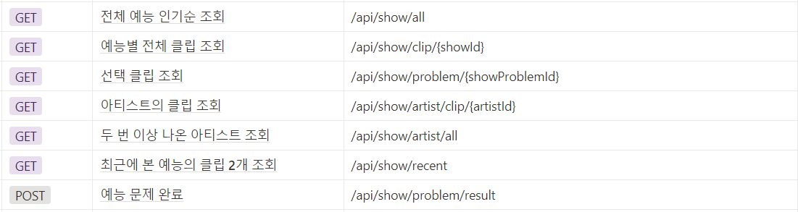

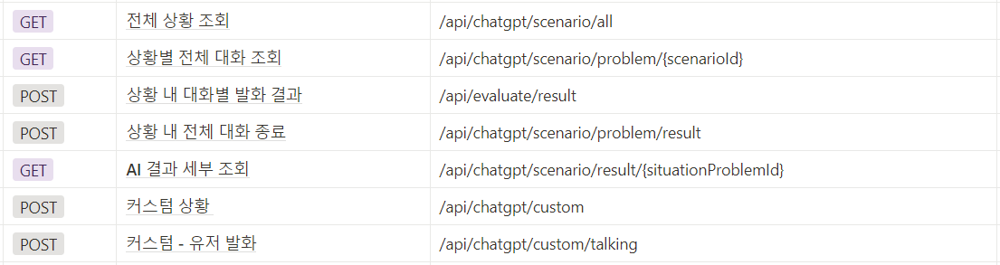

## 📏 ERD

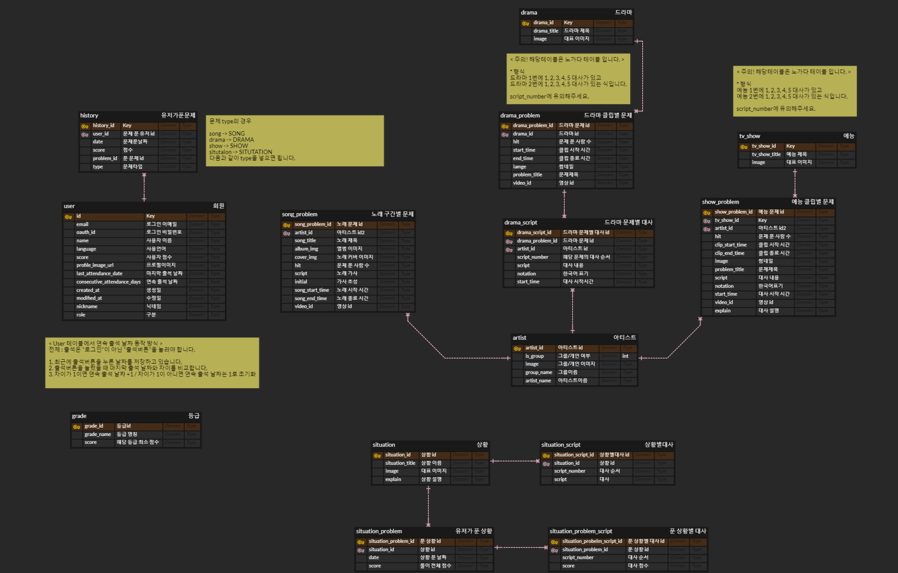

## 📐 시스템 아키텍처
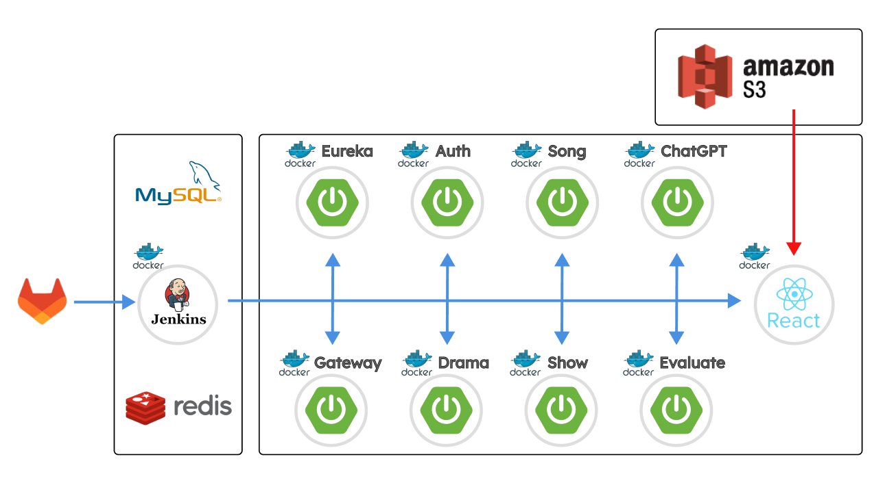

## 협업 : Notion, Mattermost

| 노션을 활용한 협업 진행                                                                                           | 멤버 정보                                                                |
| ------------------------------------------------------------------------------------------------------- | -------------------------------------------------------------------- |
| 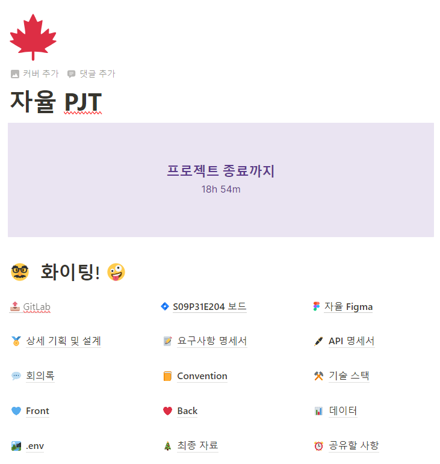 | 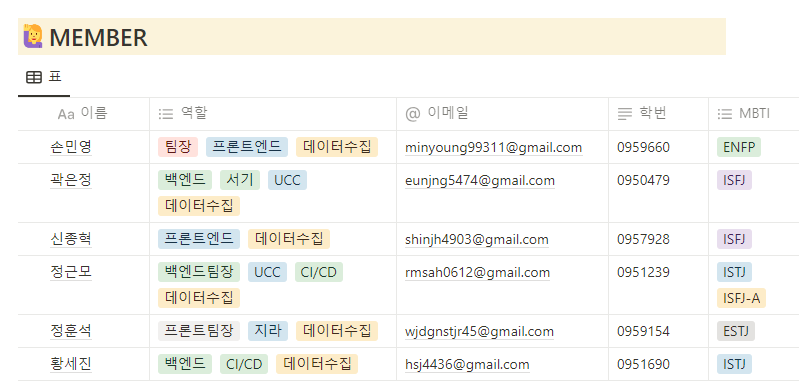 |
| 노션을 활용하여 정보를 공유하였습니다.                                                                                   | 인원 및 각자 역할                                                           |

| 스크럼 회의 및 공유                                                          | 공유주간 회고록 작성                                                          |
| -------------------------------------------------------------------- | -------------------------------------------------------------------- |
| 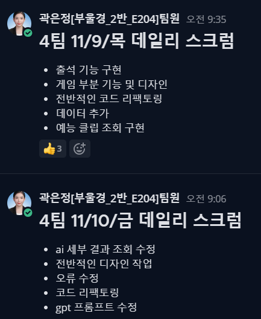 | 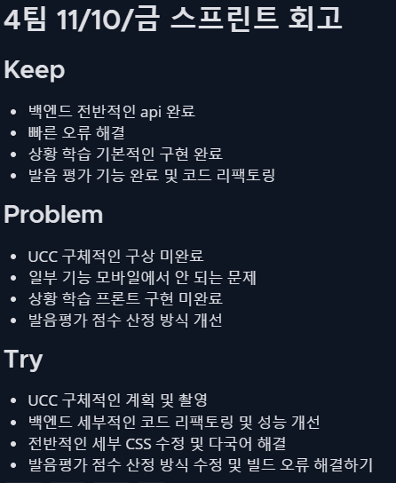 |
| 데일리 스크럼 회의를 통해 진행 상황을 공유하고 어려움을 겪는 부분은 서로 도우며 해결해나갔습니다.              | 매주 스프린트 회고를 통해 주차별로 발전해나가는 기록을 남길 수 있었습니다.                           |

| JIRA를 활용한 일정관리                                                           | Git convention & 일관된 커밋 메시지                                           |
| ------------------------------------------------------------------------ | --------------------------------------------------------------------- |
| 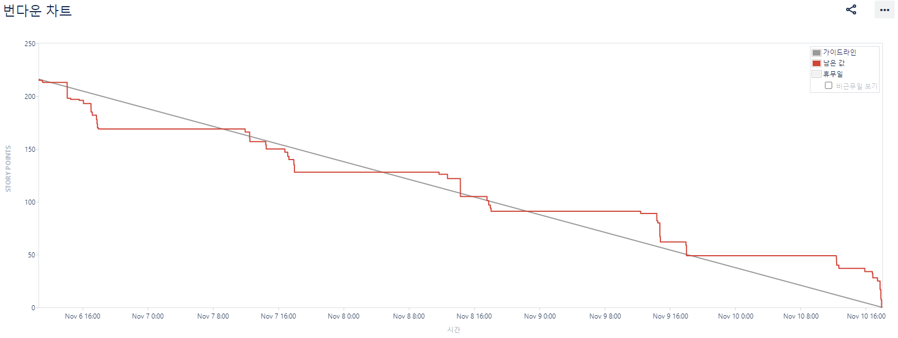 | 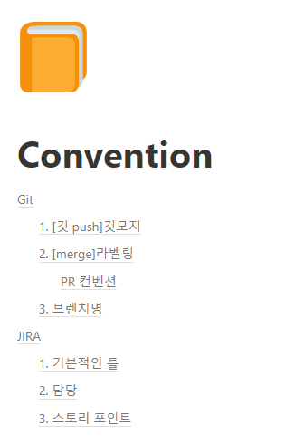  |
| JIRA를 활용하여 매주 목표를 정하고, 스프린트를 작성하여 프로젝트 전체 일정을 관리하였습니다.                   | Git 브랜치 전략과 commit convention을 정하고, 해당 컨벤션을 바탕으로 일관된 커밋 메시지를 작성하였습니다. |

# 팀원 소개 및 역할

| 손민영                                                                                                | 정훈석                                                                                                | 신종혁                                                                                                | 황세진                                                                                                         | 정근모                                                                                                | 곽은정                                                                    |
|:--------------------------------------------------------------------------------------------------:|:--------------------------------------------------------------------------------------------------:|:--------------------------------------------------------------------------------------------------:|:-----------------------------------------------------------------------------------------------------------:|:--------------------------------------------------------------------------------------------------:|:----------------------------------------------------------------------:|
| 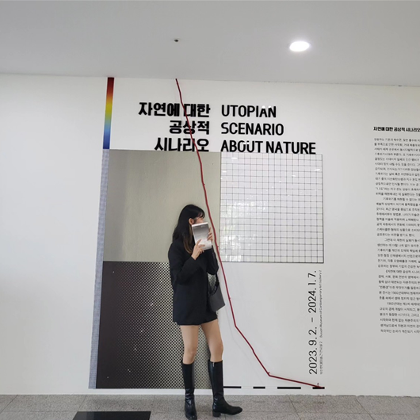 |  |  |           |  |  |
| Frontend                                                                                           | Frontend                                                                                           | Frontend                                                                                           | Backend                                                                                                     | Backend                                                                                            | Backend                                                                |
| 팀장, 발표, UI/UX 설계, 메인ㆍ챗봇ㆍ상황별 페이지 구현, 다국어 기능                                                         | 프론트엔드 팀장, UI/UX 설계, 스플래쉬ㆍ온보딩ㆍ노래ㆍ회원가입 관련 페이지 구현, 노래 게임 기능, APIㆍJWT 토큰 처리                            | UI/UX 설계, 드라마ㆍ예능ㆍ랭킹ㆍ마이 페이지 구현, 쉐도잉ㆍSTTㆍ피치분석 기능                                                     | Spring SecurityㆍJWTㆍOAuth2를 활용한 소셜 로그인 구현, API Gateway 담당, JWT 기반 Gateway Filter 구현, 회원, 드라마 문제 CRUD API 개발 | 백엔드 팀장, 서버 및 인프라, MSA 기반 서비스 독립적 배포, 데이터 베이스 설계, 한국어 발음 평가 AI, Chat GPT를 통한 상황별 대화 기능, 랭킹API 개발    | 서기, 노래 게임ㆍ예능 쉐도잉ㆍ상황 학습 API 개발, 데이터 관리, 다국어 기능, UCC 제작                   |
