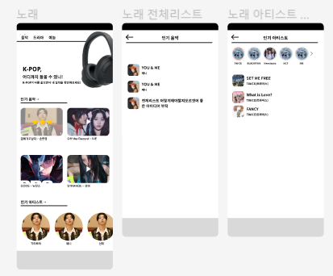
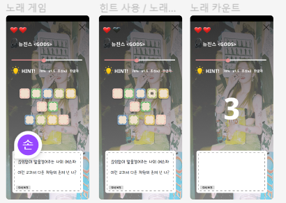
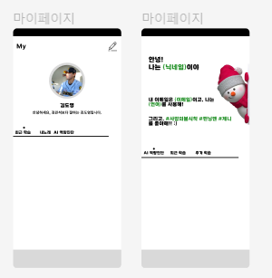

### 10월17일

- 와이어프레임 및 목업 작업
  
  1. 메인페이지
     
     
  
  2. 컨텐츠 학습
     
     
  
  3. 음악 세부
     
     
  
  4. 드라마/예능 세부
     
     

### 10월18일

- 팀회의
  
  ### 게임 진행 방식
  
  1. 처음부터 글자수 + 띄어쓰기 제공
  2. 힌트는 어떤걸 제공할건지
     1. 1.5배속, 70%듣기, 초성 힌트(2글자), 한글자
     2. 처음에도 힌트 선택 가능하게 해서 총 2라운드
  3. 인풋 창 없이 글자 칸 위에 바로 글씨 쓰기
  4. 차등 점수 (힌트 사용 시 -0.5 | 라운드 추가 시 -1)
     1. 바로 정답 - 3
     2. 힌트 하나 사용 후 1라운드 정답 - 2.5
     3. 두번째 제출 정답 - 2
     4. 힌트 1번 사용 후 2라운드에서 정답 - 1.5
     5. 1라운드 힌트 사용, 2라운드 힌트사용 통과 - 1
     6. 통과못하면 - 0
  
  ### STT
  
  - 언어별로 구분을 할 거면 언어별로 모델을 다 만들어야 함
    - 아직 리소스가 없어 만들어볼 수가 없어 성능을 평가할 수가 없음
  - 언어 구분하지 않으면 API를 쓰나, 만들어진 모델을 파인튜닝해서 쓰거나 해도 상관이 없음
  - 아직 둘 다 비교가 안돼서 그냥 미뤄두고 나중에 AI 서버 받으면 결정해야 하는지 고민
  
  ### 티어
  
  - 일정 포인트 이상이면 등급 변경
  - 브론즈 0, 실버 300, 골드 1000, 플레 3000, 다이아 5000, 루비 10000
    | top 10 챌린저
  - 랭크
    - 유저 클릭 시 프로필 확인 가능
    - 내 위치
    - 챌린저
  
  ### 점수
  
  - 노래: 별 반 개당 5점
  - 드라마/예능/상황 : 유사도 판단 1~5점(소숫점 반올림해서 첫째자리만 하기)
    - 점수 * 10만큼 포인트 제공
    - 재시도 - 이전 점수 대비 점수 상승하면 추가 점수 * 10만큼 포인트 제공
  - 출석 점수 - 달력에서 날짜 클릭 시 출석
    - 1일 - 5점
    - 연속 출석: 7일 - 15점 | 28일 - 100점 추가 제공
      - 며칠 연속 스트릭인지 보여주기
  
  ### 유사도 판단
  
  - 상황별 학습 - 우리가 제공한 상황에 대해서만 유사도 판단
  - 드라마/예능에서도 유사도 판단 제공
  - AI진단 버튼 클릭 시 유사도 판단
    - 스피킹에서 녹음하고, 들어보고 제출 클릭 시 진단하도록
    - 하루 최대 10번(전체)
    - 결제 시 추가 진단 가능하도록 기능 구현
  
  ### 유저
  
  - 마이페이지
    - 최근 학습 - 노래/드라마/예능/상황 분류 없이
    - 노래 - 점수 순
    - 역량진단 - 유사도 판단 기준
  - ~~팔로우? 라이벌?~~
  - 소셜 로그인은 구글만
    - 추가정보 받기
  
  ### 컨텐츠
  
  - 20일 금요일 오후 4시 반에 결정

- 와이어프레임 및 목업 작업
  
  1. 노래
     
     
  
  2. 노래 게임
     
     
  
  3. 마이페이지
     
     
